# 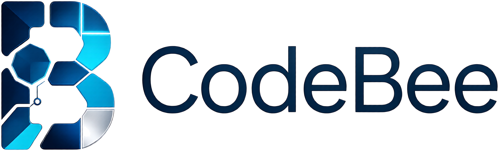 CodeBee · 多智能体编排台

> All agents, one hive. —— 一声令下，群蜂齐作。
> *CodeBee*，码蜂：蜂后统筹（编排者）、侦察蜂定方向（规划/评审）、工蜂采蜜（实现）——
> 一个蜂巢，多只蜜蜂，酿同一份蜜。

[](https://www.npmjs.com/package/codebee)
[](https://www.python.org/downloads/)
[](LICENSE)

**AI 是引擎，你的经验是方向盘。** CodeBee 为你指挥一支跨厂商的执笔/编码小队：
统一调度本机已装的 AI 编码 CLI（Codex CLI、Claude Code、Qwen Code、OpenCode、Aider、
Kimi Code、MiMo Code、Grok Build、Pi、DeepSeek Harness……），提供
**目标 → 自动拆解 → 智能路由 → 执行 → 客观验证 → 跨厂商评审 → 自动修复/换将 → 汇总报告**
的完整闭环。你不在时它们自动推进、自我打磨；需要你拍板的地方——质量闸门、任务分支的
采纳与丢弃——它们会亮起「待裁决」等你，绝不静默替你决定。

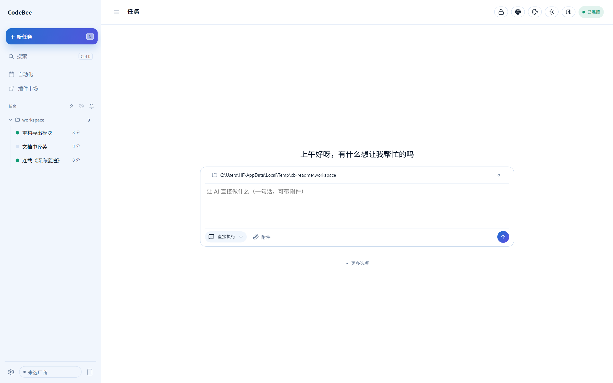

零第三方依赖：纯 Python 标准库（3.8+），本地 Web 界面，数据全部落盘可回放，
不会把你的任务内容交给任何第三方。

<!-- relnotes:start -->
### 最新版更新内容（v0.1.60）

- 同工作目录并行硬限制：后来任务自动排队等待（60 秒重试、先来者完成自动放行），不再互相覆盖
<!-- relnotes:end -->

---

## 功能速览

### 🐝 蜂巢工作台：实时盯进度，像看蜂群干活

运行详情按智能体分格，谁在采蜜一目了然：每只蜜蜂带忙碌动画，点一下直接看该 CLI
的实时日志流；步骤卡片记录每一步的角色、耗时、token 与费用。

<div>
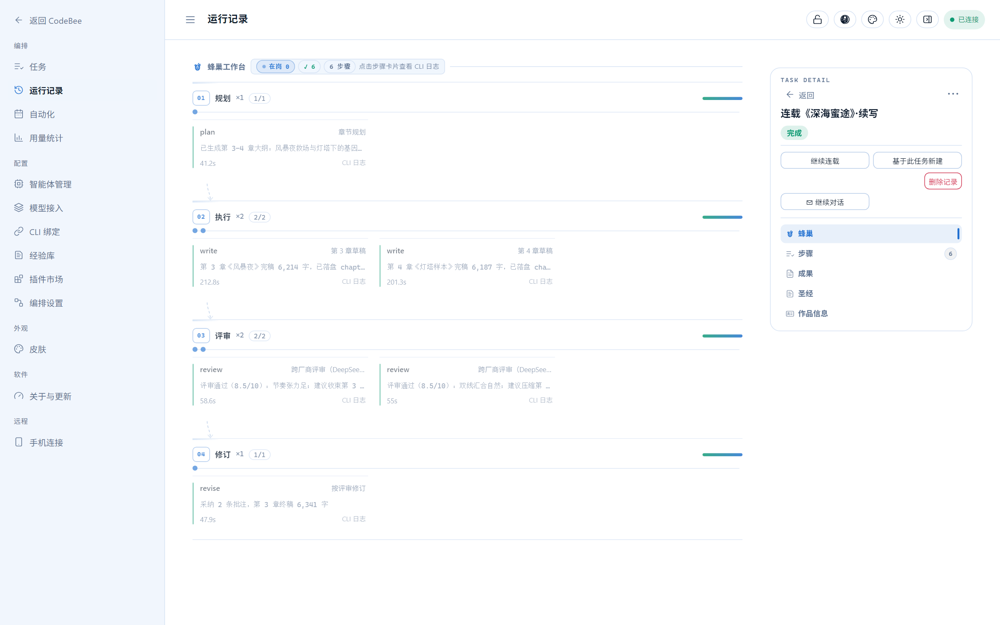
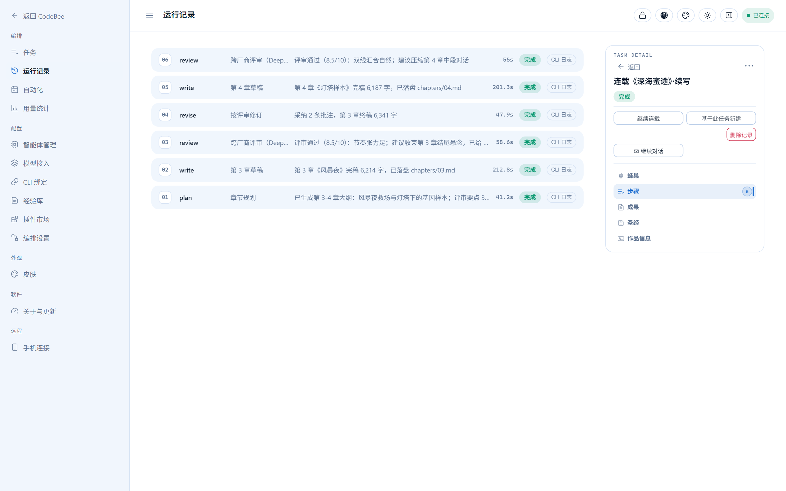
</div>

### ⚔️ 跨厂商对抗式评审

评审者强制来自与作者不同的模型族——同族自评有同款盲区，换一双"眼睛"才挑得出
陈词滥调。评审按维度独立打分 + 提行级意见，不达标自动回炉修订；无跨厂商可用时
如实备注，绝不伪装。

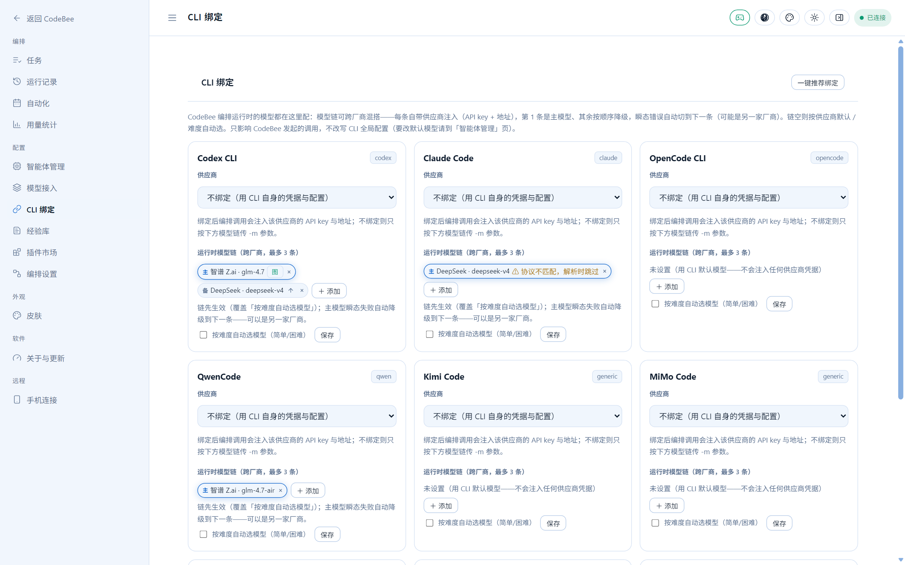

### 🔗 模型链跨厂商降级

「CLI 绑定」页把模型链配成 `主模型 → 备选 → 再备选`，每条自带供应商凭据注入
（API key + 地址，只影响 CodeBee 发起的调用，不改写 CLI 全局配置）。主模型瞬态失败
（503/限流）自动切下一条——可能是另一家厂商的模型。配额耗尽、供应商欠费也能自动接力。

### 🧠 经验库：越跑越好，无需人工维护

每次任务结束由编排者复盘评审暴露的问题，自动沉淀为教训并归类（情节逻辑 / 人物塑造 /
节奏爽点 / 文笔风格 / 一致性 / 流程规范），下次同类任务自动注入提示词。内置规范包
（如七猫签约标准）自动注入小说类任务；「插件市场」一键安装社区经验包。

<div>
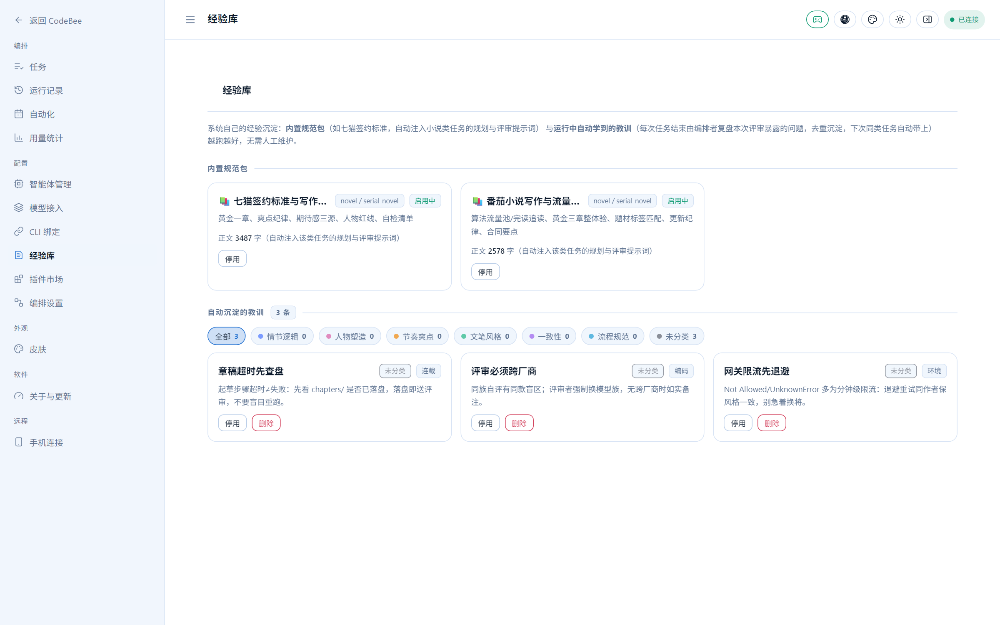
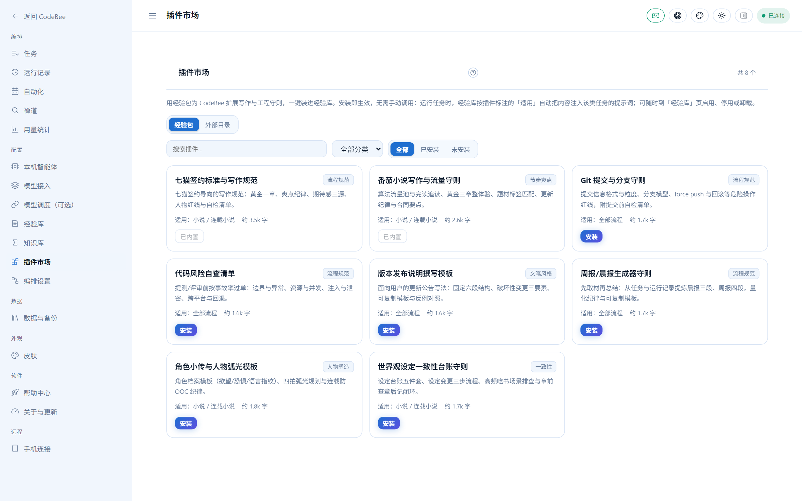
</div>

### 📚 知识库：你的个人知识管理库

与经验库是一对搭档——教训记「别这么做」，知识记「已知是这样」。任务结束由编排者
从产出材料（调研报告/文档）自动提炼可复用知识条目，默认直接转正参与注入；也可手动
新建。条目按任务类型与相关性自动注入同类任务的规划与评审提示词；事实带账龄，
as_of 超 90 天注入时自动标注「可能过期」。

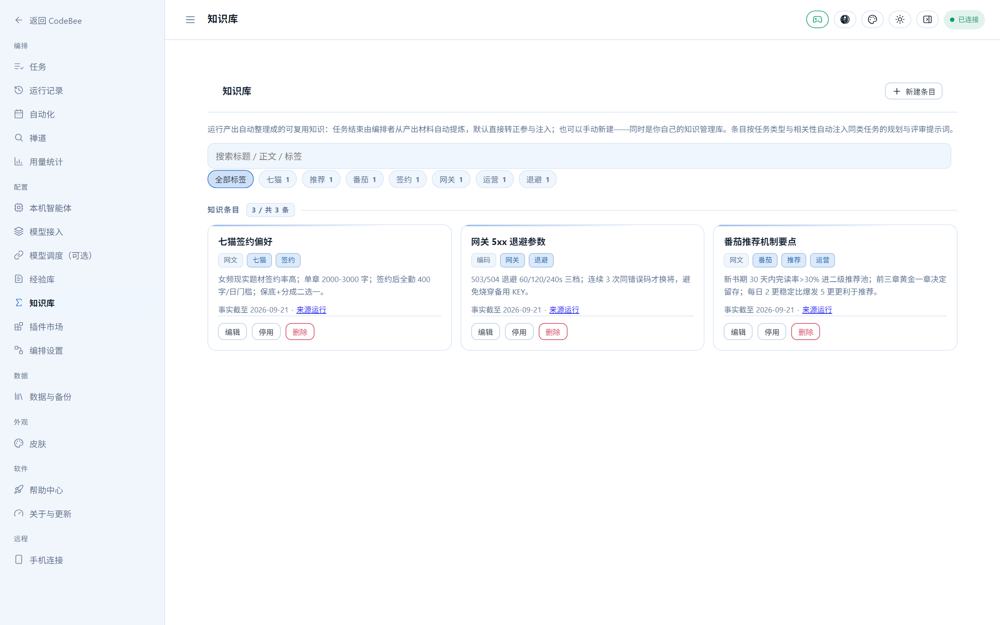

### 🛠 智能体管理台：检测 / 安装 / 升级 / 一键绑模型

自动检测本机全部 CLI（含版本号），安装失败时 AI 读日志自动诊断给修正命令；「默认模型」
写回各家 CLI 自己的配置文件；「一键绑定推荐模型」按协议适配与可用性自动配好跨厂商链。

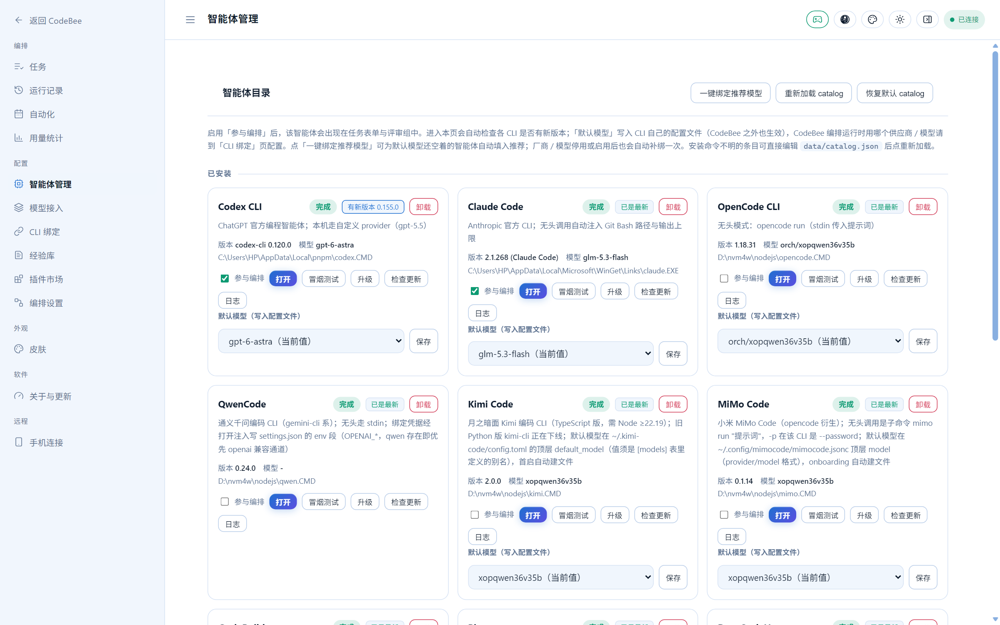

### 📡 模型接入：十种来源聚合

点「导入」扫描本机 CCSwitch / Claude Code / Codex CLI / ZCode / Qwen / Gemini /
OpenCode / Continue / Cursor / Trae 十种工具的配置，一次带入全部供应商（自动拉取模型
列表与价格表）；也支持手动添加任意 OpenAI / Anthropic 兼容网关。密钥只存本机。

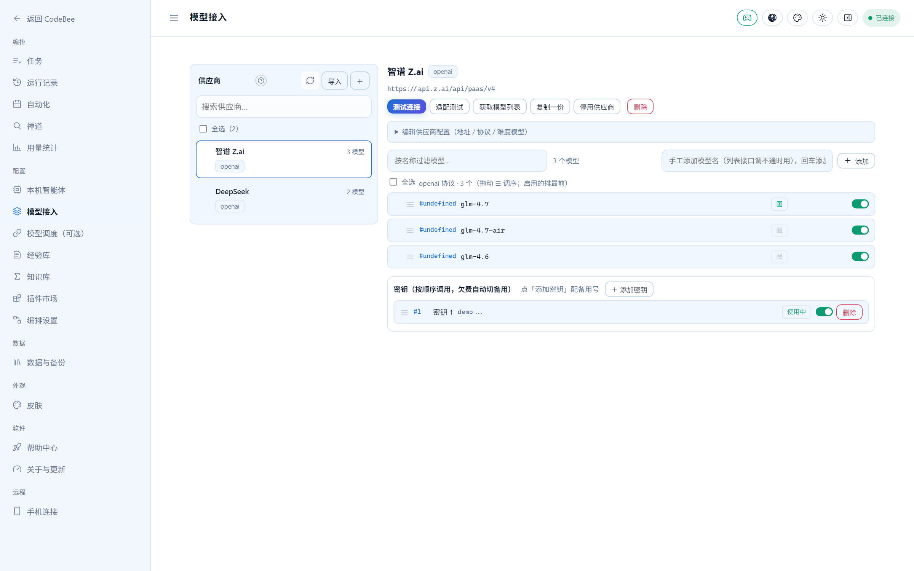

### 📊 用量台账：每一分钱都有账

所有真实 LLM 调用（编排步骤、编排者直连、连通性冒烟、AI 修复）计入 append-only
台账：总 tokens、成功率、累计费用、每日趋势（纯 SVG 零依赖），按工具 / 智能体 /
模型 / 角色 / 任务类型五维排行，支持今天 / 近 7 天 / 近 30 天 / 全部。

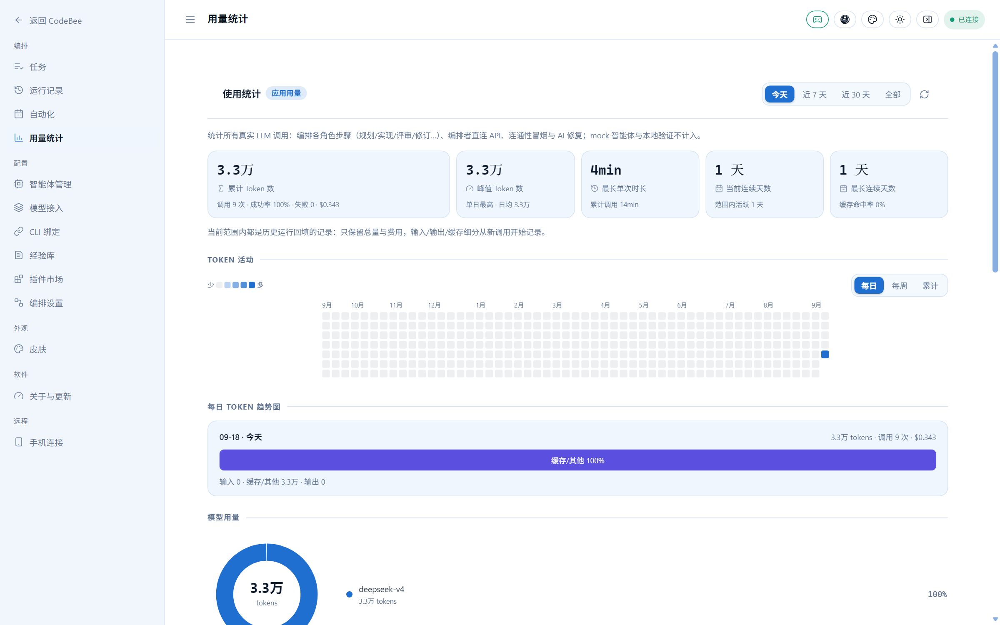

### ⏱ 自动化：定时任务无人值守

按计划自动运行任务（每天 / 每周 / 间隔 / 一次性），复用真实运行链到点开跑；
错过的临时任务标记跳过不补跑，连载类错过自动断点续跑。

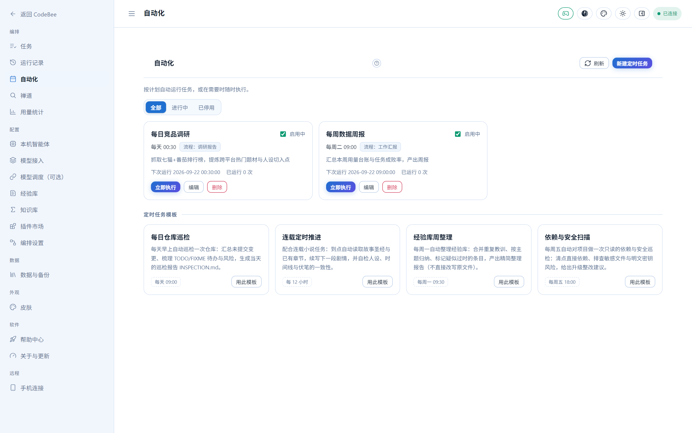

### 📖 帮助中心与作品信息

**F1** 随时呼出多章帮助中心（快速上手 / 模型接入与绑定 / 功能一览 / 连载创作流程 /
发布上架 / 代码任务与版本 / 自动化与技能市场 / 常见问题），设置页与工作台头部的
「?」直达对应章节。连载任务详情页「作品信息」按发布平台生成建书表单资料
（番茄 / 七猫），逐字段复制即用；封面生成与发布上架通道打通最后一公里。

<div>
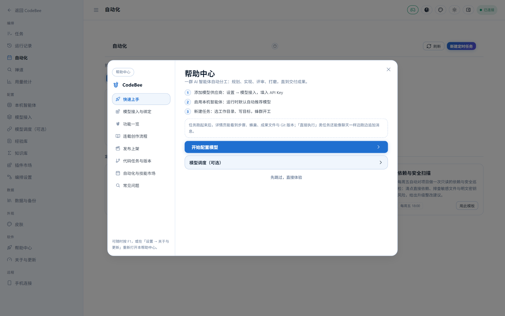
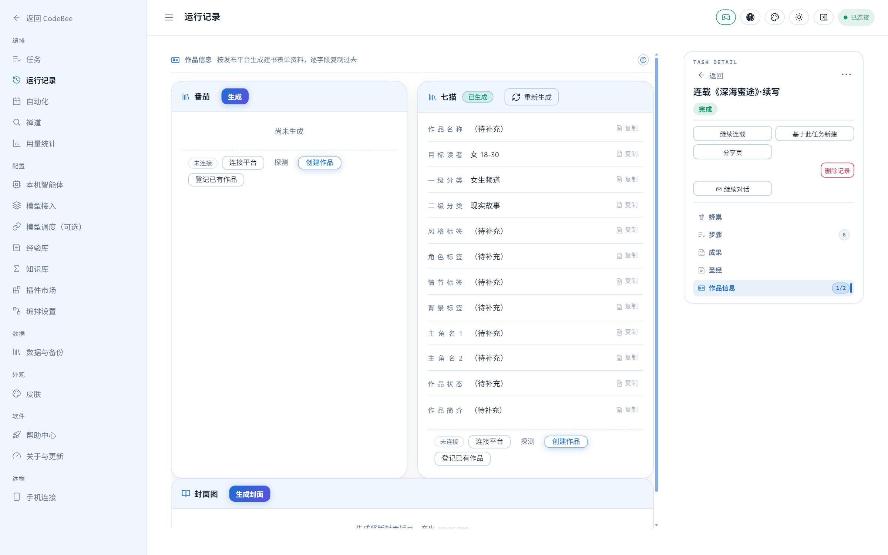
</div>

### 更多内置能力

- **15 种任务类型**：直接执行、代码、小说、连载小说、自媒体文章、短视频脚本、
  文档、翻译、扫榜选材、调研报告、演讲稿、工作汇报、商务邮件、技术方案、简历；全部支持自定义流程
  （引擎 / 评审维度 / 阈值 / 轮数 / 提示词覆盖）；
- **质量闸门与裁决**：评审失败≠0 分照过、降级大纲不开写、超时但已落盘的稿件照常
  送评审；需要人拍板的事项进「待裁决」队列（徽章 + 提示音），`tools/bee.py`
  命令行不开浏览器也能过裁决；
- **产物隔离在任务分支**：指定代码版本的任务，产物提交在 `codebee/<task-id>`
  分支上（工作区始终干净），详情页 Git 工作台看 diff，一键合并回原分支或丢弃；
- **运行中指挥**：任务跑着也能递话——文字 / 截图 / 附件注入下一轮；
- **对话模式**：不拆步骤、直接执行，时间线式对话页，随时追话续上下文；
- **自动化**：定时任务复用真实运行链，到点自动开跑（错过的一次性任务不补跑）；
- **禅道 Bug 自动修复**：多产品档案（每产品配我方端/前后端仓库/负责人），定时扫描
  激活 Bug 先排查定责（模块路由规则 > AI 判端 > 留人工）——我方端自动建修复任务
  跑完整代码链，修完自动合并；双端问题修完我方部分后带修复报告转派另一端负责人，
  非我方转回报告人；测试指错人也按排查结论改派；修复失败自动升级转派；群机器人
  全程播报（设置页「禅道」子页配置）；
- **多任务并发**：任务默认立即启动、无等待队列，并发保护上限默认 12；连载任务超时/中断自动
  断点续跑；
- **远程访问**：手机同一 WiFi 直开、Tailscale 外网可达、Cloudflare Tunnel 固定
  域名——8 位访问令牌保护，多端实时同步（SSE），单设备控制权防互踩；
- **7 套皮肤**（默认「深海」），每套自带日间 / 夜间两版，安装默认即 深海·日间 + 中文。

---

## 快速开始

**方式一：npm 安装（推荐，普通用户）**

需要本机装有 [Node.js](https://nodejs.org) 与 [Python 3.8+](https://www.python.org/downloads/)
（Windows 装 Python 时勾选 “Add python.exe to PATH”）。然后：

```bat
npm install -g codebee
codebee
```

`codebee` 命令会启动服务并自动打开浏览器（默认 `http://127.0.0.1:8765`）。
**启动后那个命令行窗口就是服务本身**——保持开着别关，Ctrl+C 即退出。
每一步启动进度都会实时打印，卡在哪一步一眼可见。

升级：`npm update -g codebee`，或在界面「设置 → 关于与更新」里一键升级；
发现新版本时页面会直接展示本次更新内容。

数据存放在用户目录（Windows `%APPDATA%\CodeBee`，macOS/Linux `~/.codebee`），
升级/重装不影响；老版本 Tutti 目录（`%APPDATA%\Tutti`）会被自动沿用，无需迁移。

### macOS：npm 全局安装报 EACCES（permission denied）

官方 pkg 安装的 Node，全局目录 `/usr/local/lib/node_modules` 归 root，直接
`npm install -g codebee` 会报
`EACCES: permission denied, mkdir '/usr/local/lib/node_modules/codebee'`。
**不要用 sudo 装**：装完目录归 root，应用内「一键升级」（以普通用户跑
`npm install -g codebee@latest`）之后每次都会撞同样的权限错误。
正确做法是把 npm 全局目录改到用户目录下，一次配好、安装与自动升级都畅通：

```bash
mkdir -p ~/.npm-global
npm config set prefix "~/.npm-global"
echo 'export PATH="$HOME/.npm-global/bin:$PATH"' >> ~/.zshrc
source ~/.zshrc
npm install -g codebee
```

默认 shell 是 bash 的话，把第 3 行的 `~/.zshrc` 换成 `~/.bash_profile`。
用 Homebrew 装的 Node（prefix 在 `/opt/homebrew`）没有这个问题，可直接安装。
验证 `which codebee` 指向 `~/.npm-global/bin/codebee` 即配置成功。

### macOS：HTTPS 请求报 SSL 证书错误（CERTIFICATE_VERIFY_FAILED）

python.org 安装的 Python 不读 macOS 系统钥匙串，本机又没有可用的 CA 束时，
「获取模型列表 / 适配测试 / 插件市场」等所有 HTTPS 检测会报
`certificate verify failed: unable to get local issuer certificate`。
CodeBee 已内置兜底：出站请求自动加载 certifi 与 macOS 系统证书束
（`/etc/ssl/cert.pem`），多数机器无需任何操作。若仍报错，补齐证书后重试：

```bash
python3 -m pip install --upgrade certifi   # CodeBee 自动采用，装完即生效
# 或：Finder → 应用程序 → Python 3.x → 双击 Install Certificates.command
```

**方式二：源码运行（开发者）**

```bat
git clone https://github.com/Vercel-By-WXP/CodeBee.git
cd CodeBee
start.bat
:: 或
python app\main.py --port 8765
```

自动打开 `http://127.0.0.1:8765`。源码模式数据落仓库 `data/` 目录。

## 作者侧命令行（可选）

不开浏览器也能过裁决队列（本机免令牌）：

```bat
python tools\bee.py status            :: 任务总览（含待裁决标记）
python tools\bee.py pending           :: 待裁决队列（分支 / 变更文件）
python tools\bee.py diff    <task>    :: 看本次变更
python tools\bee.py approve <task>    :: 采纳——任务分支合并回原分支
python tools\bee.py discard <task>    :: 否决——删除任务分支（需输 yes）
```

## 任务类型与自定义流程

主表单的「类型」下拉即流程列表，点「管理」可新增/编辑自定义流程（引擎、评审维度、
阈值、轮数、产出文件名、起草/评审提示词覆盖）。内置 15 种；禅道工单是自动转成
`code` 修复任务的集成入口，不另占菜单类型：

| 类型 | 引擎 | 流程 |
|---|---|---|
| 💬 直接执行 | direct | 不拆步骤直接跑，时间线对话页可追话续上下文 |
| 💻 代码 | code | 实现 → 验证 → 跨厂商评审 → 自动修复/换将 |
| 📖 小说 | review | 起草 → 多维评审（情节/人物/文笔/节奏/吸引力）→ 修订 → 发布门禁 |
| 📚 连载小说 | review | 大纲 → 逐章起草/评审/修订 → 全局一致性评审 → 合并成书（断点续跑/继续连载） |
| 📰 自媒体文章 | review | 平台化标题/开头/结构 → 多维评审 → 修订 → 发布门禁 |
| 🎬 短视频脚本 | review | 画面 + 口播 + 字幕/音效 → 多维评审 → 修订 → 发布门禁 |
| 📝 文档 | review | 起草 → 多维评审（准确性/结构/表达/实用）→ 修订 → 门禁 |
| 🌐 翻译 | review | 起草 → 多维评审（忠实度/流畅度/术语/风格）→ 修订 → 门禁 |
| 📈 扫榜选材 | direct | 抓七猫 + 番茄公开榜单 → 跨平台题材/人设/切入点洞察 |
| 🔍 调研报告 | review | 起草 → 多维评审（全面性/深度/论据/结论）→ 修订 → 门禁 |
| 🎤 演讲稿 | review | 起草 → 多维评审（主题/结构/感染力/语言）→ 修订 → 门禁 |
| 📅 工作汇报 / ✉️ 商务邮件 / 📋 技术方案 / 📄 简历 | review | 各自专属角色、交付约束与评审维度 |

三种引擎：
- **direct 引擎**：单智能体直接执行目标，保留会话上下文，适合问答、探索和无需评审链的快捷任务；
- **code 引擎**：实现者在工作目录直接改代码 → 执行验证命令（确定性结果）→ 跨厂商评审
  （结构化 JSON）→ 不通过则自动修复循环（至多 2 轮）→ 仍失败自动换将全量重实现；
- **review 引擎**：作者起草产出文件 → 多个评审智能体按维度独立打分 + 提问题 →
  任一维度低于阈值则汇总 major 意见回炉修订 → 所有维度达标才标记"达到发布标准"。

自定义流程的参数在创建任务时固化到任务上，之后修改流程定义不影响已建任务。

### 连载小说与继续连载

「连载小说」按批次写作：大纲 → 逐章起草/每章评审修订 → 全局一致性评审 → 合并成书。
写完一批想接着写下一批（比如先写了前 10 章，现在续写 11–20 章）：

- **侧栏任务右键 → 「继续连载（新任务）」**，或打开任务/运行详情点「继续连载」按钮；
- 弹框填续写章数（默认与上一批相同）→ 自动**新建一个任务**开跑。

续写任务沿用原任务的目标/上下文/工作目录/评审设置，从已写到的新一章接着写：
旧章一字不动，章节文件（`chapter-NN.md`）与成书合并（`manuscript.md`）都按
全书章号衔接；续写大纲会自动注入前情大纲与最新一章结尾作衔接锚点，保证跨批
剧情连贯；新任务标题自动带「·续 / ·续2」代数。若上一批没写完（超时/中断），
先用「↻ 重试任务」断点续跑补完本批（继承大纲与已完成章），再「继续连载」写
下一批。「继续连载」只出现在连载任务上（带章节衔接语义）。

任何任务右键 → 「基于此任务新建」可把同款配置预填进新建表单（连载的章节衔接
请用「继续连载」；沿用同一工作目录会覆盖原产出，表单会提醒）。

## 极简输入 + 会话延续

主表单只有 3 项：**类型、目标（一句话）、工作目录**（自动记住上次填写）。
标题自动取目标首行；其余（上下文/验证命令/编排模式/实现者/评审组/轮数/阈值）全部
收进"高级选项"折叠，默认全智能无需改动。

**在已有会话上继续**：「继续会话」下拉列出本机**已安装且支持会话恢复**的 CLI
（Codex CLI、Claude Code、OpenCode、QwenCode、MiMo Code 等），选中后 CodeBee 扫描
其本地会话（时间 / 项目 / 内容预览），挑一条即可延续那个会话的完整上下文——
实现者自动指定为对应智能体，规划、实现、修复都在原会话上进行（评审仍用新鲜
上下文避免偏见）。

各家会话存放位置与恢复方式（2026-09 本机实测）：

| CLI | 会话位置 | 恢复方式 |
| --- | --- | --- |
| Codex CLI | `~/.codex/sessions/**.jsonl` | `codex exec resume <sid>` |
| Claude Code | `~/.claude/projects/*/<sid>.jsonl` | `claude -p --resume <sid>` |
| OpenCode | `~/.local/share/opencode/opencode.db`（SQLite） | `opencode run -s <sid>` |
| QwenCode | `~/.qwen/projects/*/chats/<sid>.jsonl` | `qwen -r <sid>` |
| MiMo Code | `~/.local/share/mimocode/mimocode.db`（SQLite） | `mimo run -s <sid>` |

两点注意：续会话是**显式指定**，不要求该 CLI 在设置页开启「参与编排」；
headless 一次性调用的 CLI（如 DeepSeek Harness）不支持会话恢复，不出现在下拉里。

## 手机 / 远程访问

服务默认监听 `0.0.0.0`，启动时控制台会打印所有可用地址：

```
[CodeBee] 本机      http://127.0.0.1:8765
[CodeBee] 局域网    http://192.168.x.x:8765/?token=xxxxxxxx   ← 手机同一 WiFi 直接打开
[CodeBee] Tailscale http://100.x.x.x:8765/?token=xxxxxxxx     ← 外网随时随地访问
```

- **令牌**：远程访问受访问令牌保护（首次启动生成，存于 `data/remote.json`；本机
  127.0.0.1 免令牌）。手机打开带 `?token=` 的地址后自动记住；令牌错误会弹输入门。
- **多端同步**：所有设备看到同一份实时状态（SSE 推送，秒级），断线自动降级为轮询。
- **控制权**：同一时刻只有一台设备能操作，空闲时任意操作自动接管，其他设备只读，
  顶栏胶囊一键抢回；45 秒无操作自动释放。
- **外网**：手机与电脑都装 [Tailscale](https://tailscale.com) 登录同一账号即随时随地访问。

### 公网访问（自己的域名 + Cloudflare Tunnel）

```bat
:: 一次性配置：cloudflared 登录后创建隧道并绑定子域名
cloudflared tunnel login
cloudflared tunnel create codebee
cloudflared tunnel route dns --overwrite-dns <隧道UUID> codebee.你的域名.com

:: 之后日常启动（服务 + 隧道一键起）：
start-public.bat
```

- 真本机（不带转发头的 loopback）不受影响。
- `--public-url` 让「手机连接」弹框的二维码直接给公网地址。
- 公网暴露面 = 8 位访问令牌；想更强可叠加 Cloudflare Access（零信任，免费档 50 用户）。
- Cloudflare 免费版即可：无需公网 IP、无需备案、不开任何入站端口。

### 公网访问（零配置临时隧道）

装了 [cloudflared](https://developers.cloudflare.com/cloudflare-one/connections/connect-networks/downloads/)
（`winget install Cloudflare.cloudflared`）后，**默认启动即自动建立 Cloudflare 临时隧道**：
控制台打印一个随机的 `https://xxx.trycloudflare.com` 公网地址，出门扫码即用。
每次重启地址会变（手机重新扫码即可）。

- 已有 Cloudflare 隧道凭据的机器（`~/.cloudflared` 下有 `*.json`）不会自动起临时隧道，
  请走固定域名路径；`--no-public-tunnel` 可彻底关闭该行为。
- 打开即自动强制 `--trusted-proxy`：公网暴露 ⇆ 反代回源令牌校验，二者永不分离。

## 多任务并发

任务执行器采用直接启动模式（并发保护上限默认 12，设置页「编排设置」可调 1-12）：多个任务同时跑、
互不打扰——每个任务独立线程，运行数据按 run 隔离，不进入等待队列。达到保护上限时本次请求明确失败并提示稍后重试；并发数调小只影响后续任务，已有任务继续完成。
连载任务超时/中断会自动断点续跑；重试前按明确时间退避，防止在网关限流墙上连续撞死，
这段等待不占执行位，也不属于任务容量排队。

## 编排设置（编排者模型）

「编排设置」页可给 **CodeBee 自己的智能体**指定一个厂商的模型（直连 API，不占
CLI 会话）：统一负责任务的**规划拆解、难度判定与写作大纲**。未启用或调用失败时
自动回落为「最强可用 CLI 智能体」规划，流程永不阻塞。三种协议（anthropic /
openai / google）都可作编排者；一键测试连通。

## 两种智能体

- **真实智能体**：来自 `data/catalog.json`，已安装且在管理页勾选"参与编排"的 CLI；
- **mock 智能体**（演示智能体 A/B）：内置、零消耗，用于验证流程 / 演示 / 回归测试。

mock 的评分逻辑是确定性的：第 1 轮故意略低于阈值、第 2 轮达标——用来验证发布门禁。
仅当本机一个真实智能体都没有时才回退显示在表单里。

## 模型接入（API 供应商）

"模型接入"页是**主从视图**：左侧选供应商，右侧看该供应商的模型。

- **导入（多来源）**：点「导入」弹出扫描结果，列出本机所有受支持的 AI 工具及各自可导入
  的供应商数量，勾选后可一次导入。支持 **CCSwitch（含 Claude Desktop / Codex / Gemini /
  OpenClaw）、Claude Code、Codex CLI、ZCode、Qwen Code、Gemini CLI、OpenCode、Continue、
  Cursor、Trae**——只读这些工具的配置，不改写它们本身；导入后**自动拉取各供应商的可用
  模型列表**（后台并发，CCSwitch 的每百万 token 价格表一并带入）；按「来源 + 原始条目」
  幂等，重复导入原地更新并保留你设置的模型、启停状态与已删除墓碑；
- **手动添加**：点「＋」弹出表单（名称 / 协议 / API 地址 / 密钥 / 默认与难度模型），
  保存后自动拉取模型列表；地址若误填成 `.../v1/chat/completions` 会自动收敛为基址；
- **协议**：`anthropic` 与 `openai` 可注入 CLI；`google`（Gemini）**仅登记**——
  可查看、可拉取模型列表，但不会出现在 CLI 绑定的下拉里；
- **左侧供应商列表**：名称、协议、来源标签、已拉取的模型数；支持批量启用/停用/删除；
  停用即「暂不参与编排」，配置与墓碑保留，随时可再启用；
- **右侧供应商详情**：测试连接（连通性 + 延迟）；模型按协议分组、每行可测试
  （1-token 真实对话，显示 `✓ 850ms` 或 `✗ HTTP 402 欠费`）与启停；批量操作原子生效；
  拖动 ☰ 调整调用优先级；删除模型是标记隐藏而非物理移除（刷新/重导入不会带回来），
  「已删除 N 个」可恢复；
- **自动优先级**：新拉取的模型按名称启发式自动排序（pro/opus 强者靠前，
  mini/flash 便宜者靠后），手动调序后刷新会保留你的顺序；
- **协议适配**：网关实际支持的 wire（responses / chat completions）可一键「适配测试」
  实测登记；`protocol=auto` 的供应商按实测能力集自动归类；
- **运行时语义**：「CLI 绑定」页的**模型链可跨厂商混搭**——每条自带该供应商的
  凭据注入（API key + 地址），第 1 条是主模型，其余按序降级：主模型瞬态失败
  （503/限流/无可用通道）自动切到下一条，**可能是另一家厂商的模型**（最多 3 条）；
  链空则按供应商默认 / 难度路由自动选；同厂商多密钥可配多把 KEY，欠费/冷却自动切备用；
- **安全**：拉取与测试仅访问用户自己配置的 http/https 地址，解析 IP 做边界校验、
  禁用重定向；内网自建网关（私网 IP）导入时自动放行 `allow_private`；
  密钥只存本机 `data/models.json`。

## 智能编排（默认模式）

任务表单默认"智能"模式：只填 **目标 + 工作目录**，其余由系统决定：

1. **规划**：最强可用智能体把目标拆成 ≤4 个有序子任务（JSON 计划，失败退化为单步模板），计划在运行详情可见；
2. **智能路由**：能力基线 × 历史胜率（过往 run 的 verdict 统计）打分选实现者；评审者强制跨厂商；每一步记录"为什么选它"；
3. **自动修复**：验证或评审不通过 → 问题清单自动发回实现者修复 → 重验证 → 重评审（至多 2 轮）；
4. **自动换将**：修复穷尽仍失败 → 自动切换到次优智能体全量重实现一次；
5. **报告**：结论、评分、路由依据、修复轮数、问题清单。

"手动"模式保留完整人工控制（指定实现者、评审组等），行为同 v1。

## 智能体管理

"智能体管理"页提供：

- **检测**：已装 / 未装、版本号（CLI `--version` / UWP AppxManifest / PowerShell）；
- **安装 / 升级 / 卸载**：执行 catalog 里配置的命令，日志**实时流式落盘**（边跑边看）；
  **安装失败时 AI 自动诊断**——真实智能体读取失败日志 + 本机环境给出修正命令，
  只有命中白名单（`npm install` / `winget install` / `pip install` 前缀）才自动执行，
  否则留待人工确认；卸载命令由安装命令自动推导，特殊渠道可显式覆盖；
- **模型配置**：工具默认模型（写回各家配置文件，自动备份 `.bak`）；
  CodeBee 编排运行时用哪个供应商 / 模型统一在「CLI 绑定」页配置；
- **编排开关**：决定哪些 CLI 参与任务路由。

Kimi Code / MiMo Code / Grok Build / Pi / DeepSeek Harness 的安装命令已内置（均取自
各工具官方渠道）。若某个条目的安装命令缺失，直接编辑 `data/catalog.json` 补上
`install` 字段保存后点"重新加载 catalog"即可；点"恢复默认 catalog"可回滚。

## 接入原理（已在本机实测）

| CLI | 无头调用 | 输出解析 |
|---|---|---|
| Codex CLI | `codex exec --skip-git-repo-check --json -s <sandbox>`（stdin 传提示词） | JSONL 事件流：`item.completed`=回答，`turn.completed`=token 用量 |
| Claude Code | `claude -p --output-format json`（stdin 传提示词；自动注入 Git Bash 路径与输出上限） | 单个 JSON：`result` / `total_cost_usd` / `usage` |
| DeepSeek Harness | `dsh --profile headless "<任务>"`（任务只能走位置参数） | stdout 即最终回答；退出码 0=完成 / 1=错误 |

- **模型指定因 CLI 而异**：codex/claude 支持运行时注入（env / `-c` 覆盖）；dsh 只认
  `~/.dsh/settings.yaml` 的配置项，凭据走 `DEEPSEEK_API_KEY` 环境变量（不落盘）；
  kimi/grok-build/mimo/pi/openclaw 的默认模型落点均已逐一实测内置，配置由 CodeBee
  托管写入（自动备份）。
- **协议闸门**：claude 只吃 anthropic wire、codex 只吃 openai responses、dsh 只吃
  OpenAI 兼容 chat——不匹配的供应商在绑定与起跑前就会被剔除并提示，不会产生
  「必然失败的注入组合」。
- 所有子进程：并发读管道防死锁、超时/取消杀整棵进程树（`taskkill /T`）、stdout 全量
  落盘；输出静默看门狗（默认 600s）防个别 CLI 卡死，超时自动换将接力。

## 目录约定

```
data/（npm 安装：%APPDATA%\CodeBee 或 ~/.codebee；源码模式：仓库 data/）
  catalog.json          智能体目录（可手动编辑）
  orchestration.json    编排偏好（参与编排开关）
  models.json           供应商 / CLI 绑定（跨厂商模型链）/ 多 KEY
  flows.json            自定义任务流程
  settings.json         运行设置（最大并发数）
  tasks/*.json          任务
  runs/<run_id>/        每次运行：run.json、steps/*.log、report.md、error.log
  usage/                用量台账（usage-YYYYMM.jsonl，按月分文件，append-only）
  skills.json           经验库（教训 + 规范包）
```

安全约束（内置，勿绕过）：配置路径必须位于用户主目录内；任务工作目录必须是已存在的
绝对路径；稿件文件名消毒后限制在工作目录内；步骤日志读取禁止目录穿越；
远程写操作需设备控制权 + 访问令牌。

## 测试

```bat
cd tests && python -m unittest discover -p "test_*.py" -v
python tests\e2e_service.py   :: 起真实服务的端到端（临时数据目录 + 独立端口，零配额）
node tests\ui_check.mjs       :: Edge headless + CDP 的 UI 交互验证
node tests\ui_audit.mjs       :: 全页面体检（逐页可见性 + 控制台异常）
node tests\ui_skin.mjs        :: 皮肤核验（调色板变量对齐 + 换肤/持久化）
```

单元测试（解析器/消毒/穿越防护/mock 确定性/流程注册表/跨厂商链/编排者/并发池/
自更新一致性）+ 端到端（mock 全流程、门禁逻辑、验证失败拦截、服务级 API 全链路），
全部不消耗真实配额。

## 更新日志

见 [CHANGELOG.md](CHANGELOG.md)。应用内「设置 → 关于与更新」可检查更新、查看
每次更新的内容并一键升级（npm 安装模式）。

## License

[MIT](LICENSE)
